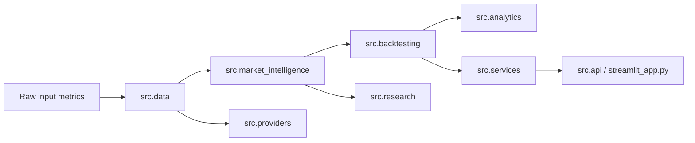

# Feature Dependency Graph

## Dependency notes

- `src.data.model_data_field_catalog` is the canonical catalog for model inputs and output metrics.
- `src.market_intelligence.feature_packs` is the canonical catalog for sport and market pack definitions.
- `src.services.streamlit_dashboard_data` is the canonical dashboard contract for feature visibility.
- `src.backtesting.backtest_schema` is the canonical leakage-safe boundary.
