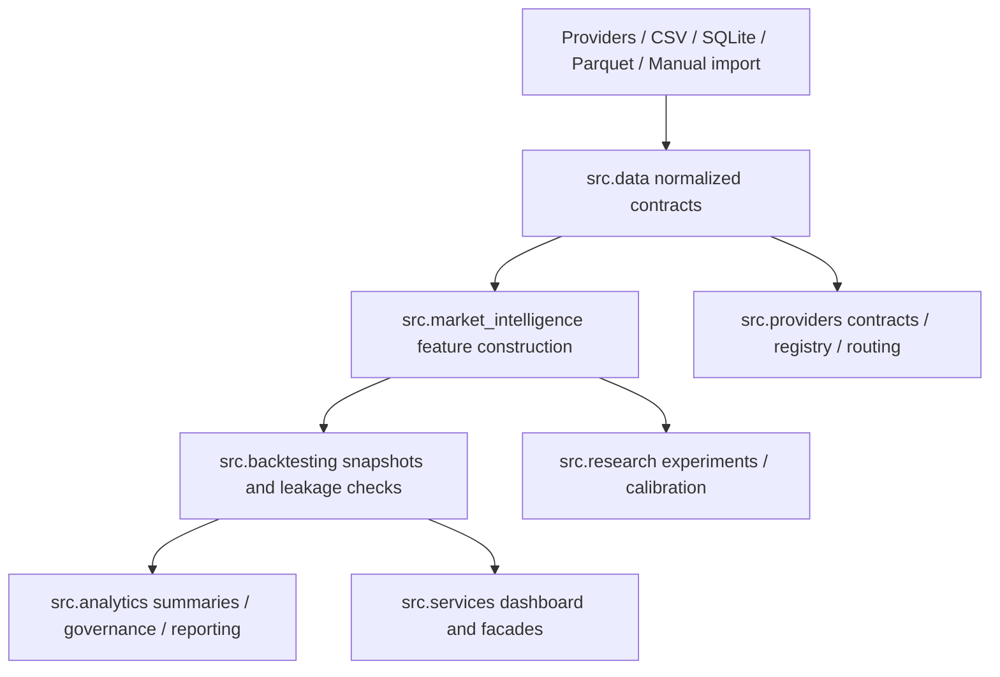

# Feature Pipeline Graph

## Pipeline summary

- Raw source candidates land in `src.data`.
- Canonical feature construction happens in `src.market_intelligence`.
- Leakage-safe snapshots and simulations happen in `src.backtesting`.
- Readiness and governance summaries land in `src.analytics` and `src.services`.
- Research and ablation remain separate from operational models.
