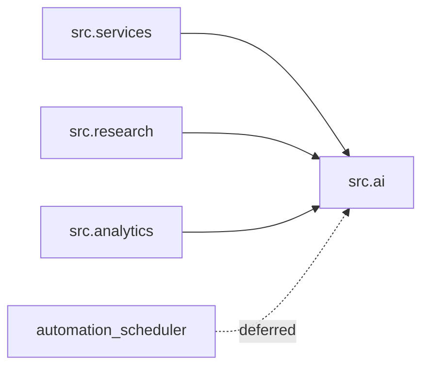

# Post AI Boundary Architecture Map After 10K8ZI9

Notes:
- `src.ai` is disabled and local-only.
- `automation_scheduler` still carries AI-adjacent legacy surfaces.
- No AI execution boundary is active.

