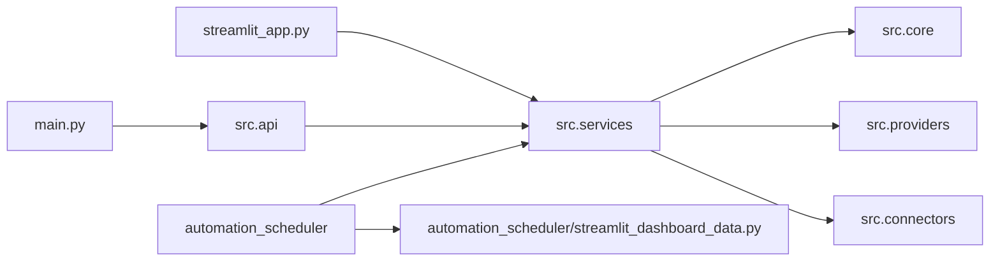

# Post Service Thinning Architecture Map After 10K8ZHH

## Notes

- `src.services` is the orchestration boundary.
- `src.core` is the math/risk/pricing/probability boundary.
- `src.providers` is the normalized provider boundary.
- `src.connectors` is the disabled raw data boundary.
- `main.py` and `streamlit_app.py` remain shell boundaries.
- `automation_scheduler` remains a decommission target.
