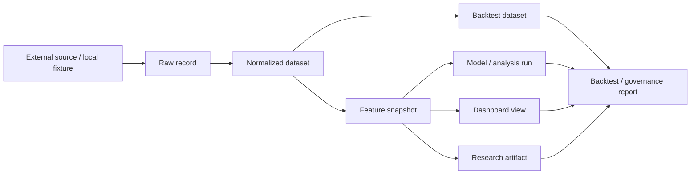

# Data Flow Map

## Canonical Flow

## Ownership

- Raw and normalized data contracts live under `src.data`
- Feature snapshots are owned by the canonical data platform and reused by backtesting and dashboards
- Reports consume canonical data rather than creating their own duplicate storage
- Historical and versioned records should preserve lineage so the full transformation path remains reproducible

## Governance

- Every record should be traceable from source to downstream usage.
- Any new data path should first ask whether the repo already has a canonical owner for that responsibility.
