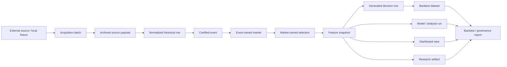

# Data Flow Map

## Canonical Flow

## Ownership

- Acquisition, event certification, and historical research database orchestration live under `src.data`
- Raw and normalized data contracts live under `src.data`
- Shared storage tables and physical persistence live under `src.storage`
- Feature snapshots are owned by the canonical data platform and reused by backtesting and dashboards
- Reports consume canonical data rather than creating their own duplicate storage
- Historical and versioned records should preserve lineage so the full transformation path remains reproducible
- Decision rows are derived later from certified event, market, selection, and feature data; they are not the primary historical storage primitive

## Governance

- Every record should be traceable from source to downstream usage.
- Any new data path should first ask whether the repo already has a canonical owner for that responsibility.
