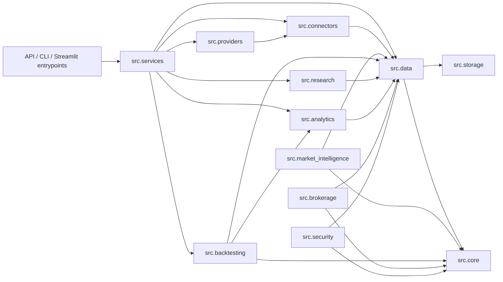

# Dependency Flow Map

The repository is organized to keep high-level runtime surfaces thin and low-level primitives reusable.

## Intended Flow

## Dependency Rules

- `src.core` is the lowest reusable layer and should not import high-level packages.
- `src.data` should not import `src.api` or `src.services`.
- `src.providers` should not import `src.api`.
- `src.services` may orchestrate higher-level workflows but should avoid owning duplicate business logic.
- `src.api`, `main.py`, and `streamlit_app.py` should stay thin and delegate to canonical modules.

## Violation Handling

- If a dependency direction is unclear, classify the responsibility first and move the code to the lowest correct owner.
- If a module is only a compatibility surface, keep it thin and document the forwarding behavior.
- If a dependency is historical only, document it in `docs/archive/` rather than keeping it in runtime code.
