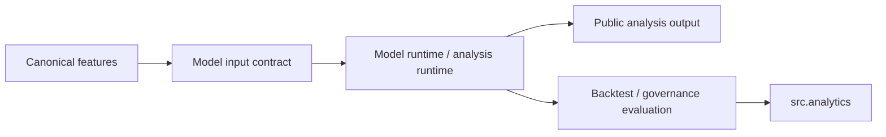

# Model Flow Map

## Current Pattern

There is no separate public `src.models` package in this repository. Model-like concerns are split by responsibility:

- `src.ai`: disabled AI and prompt metadata
- `src.market_intelligence`: model inputs and intelligence-oriented scoring
- `src.research`: experiments, calibration, and feature studies
- `src.backtesting`: evaluation of model or strategy behavior against historical data
- `src.analytics`: model-readiness summaries and governance reports

## Flow Expectations

## Boundary Rules

- Public docs should describe model behavior without exposing private feature engineering or weights.
- If a model-related helper is reused across packages, promote it to the lowest stable owner rather than cloning it.
