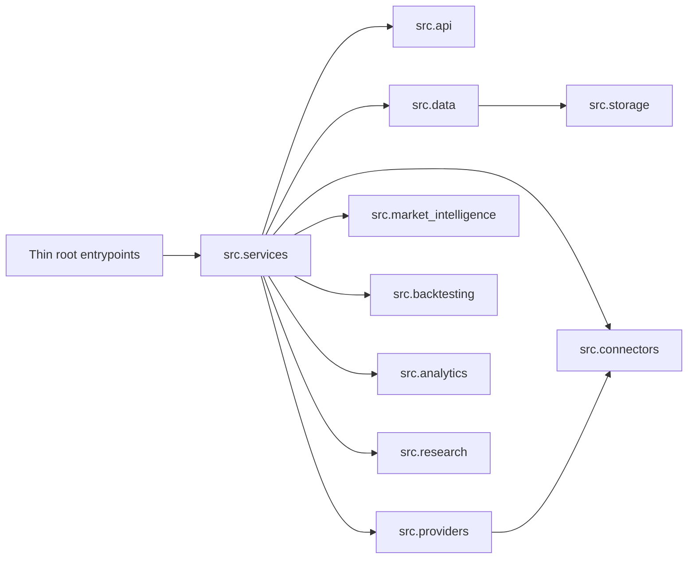

# Runtime Flow Map

## Typical Runtime Path

## Notes

- Root entrypoints are intentionally thin.
- Runtime behavior should flow through canonical service layers, not through duplicated top-level packages.
- Reporting and dashboard surfaces should consume canonical data rather than constructing their own independent storage paths.
