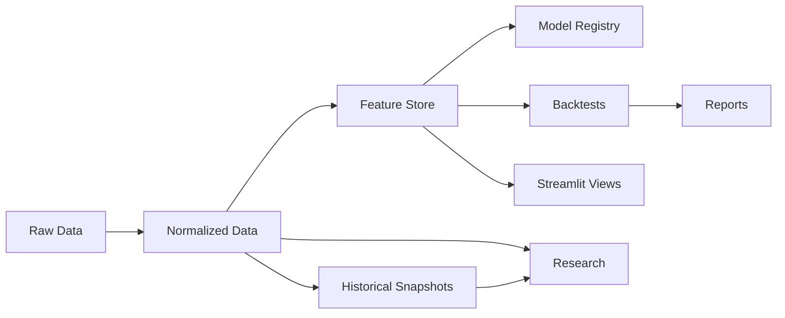

# Storage Layer Documentation

## Layering Rules

1. Raw data is write-once, append-only, and never mutated in place.
2. Normalized data is the first canonical read layer for downstream jobs.
3. Feature store outputs are versioned by feature pack and snapshot lineage.
4. Historical snapshots preserve reproducibility for backtests and audits.
5. Reports are split between machine-generated runtime reports and human-readable docs.
6. Archives retain historical artifacts that are useful for audit or provenance.

## Write Path

## Operational Notes

- Every layer must preserve `schema_version`, `snapshot_id`, and `lineage_id` where applicable.
- `quality_score` is a required metadata field for validated records.
- The storage design must stay market-agnostic; market-specific folders belong only in partition keys, not in the top-level hierarchy.
- Runtime code should read from the canonical storage API rather than constructing ad hoc file paths.
