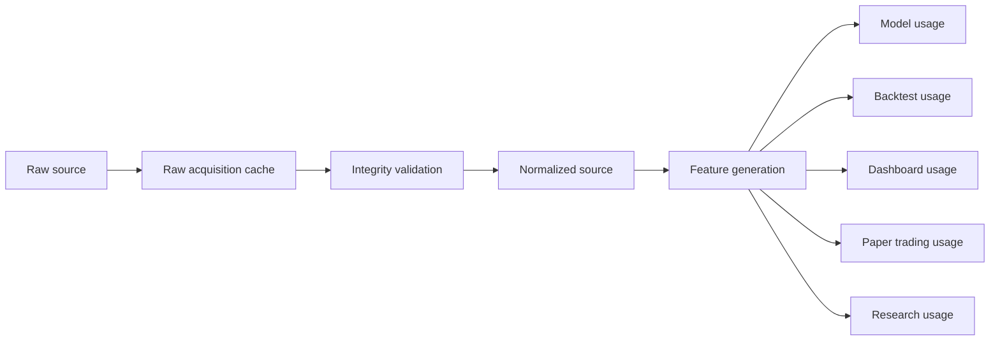

# Data Lineage Contract

## Contract

Every record that enters the platform must remain traceable through the following stages:

- raw source
- normalized source
- feature generation
- model usage
- backtest usage
- dashboard usage
- paper trading usage
- research usage

## Required Identifiers

| Identifier | Purpose |
| --- | --- |
| `snapshot_id` | Time-bounded representation of source state. |
| `lineage_id` | End-to-end lineage graph key. |
| `version_id` | Versioned artifact key. |
| `schema_version` | Structure compatibility key. |
| `source` | Raw source label. |
| `provider` | Upstream provider label. |
| `market` | Market family. |
| `market_type` | Market subtype. |
| `asset_class` | Asset class. |
| `quality_score` | Validation confidence. |

## Acquisition And Certification Lineage

Historical dataset acquisition must also preserve the dataset versioning and certification chain.

| Identifier | Purpose |
| --- | --- |
| `dataset_id` | Permanent dataset catalog key. |
| `dataset_version` | Certified dataset version string. |
| `dataset_revision` | Revision marker for corrections or enrichment. |
| `acquisition_timestamp` | When the acquisition job materialized the dataset. |
| `research_asset_certification_id` | Certification record key for the individual research asset. |
| `research_asset_id` | Permanent identifier for the research asset being certified. |
| `certification_timestamp` | When the repository certified the dataset version. |
| `certification_status` | Repository certification state for the version. |
| `coverage_score` | Repository-owned coverage signal for the version. |

Rules:

- lineage must connect provider source -> acquisition job -> raw acquisition cache -> integrity validation -> normalization -> research asset certification -> dataset certification -> certified dataset version
- lineage must connect provider source -> acquisition job -> raw acquisition cache -> integrity validation -> normalization -> certification -> certified dataset version
- the raw acquisition cache preserves the original payload for audit and replay without redownloading source data
- one certified dataset version may combine multiple provider contributions
- the repository must be able to trace a certified version back to the source bundle and the versioned dataset registry entry
- acquisition and certification timestamps must be stable enough to support replay and audit

## Flow Diagram

## Rules

- Lineage must be immutable once published.
- A record may have multiple consumer edges, but each edge must reference the same canonical source version.
- Backtests and dashboards must not bypass lineage metadata.
