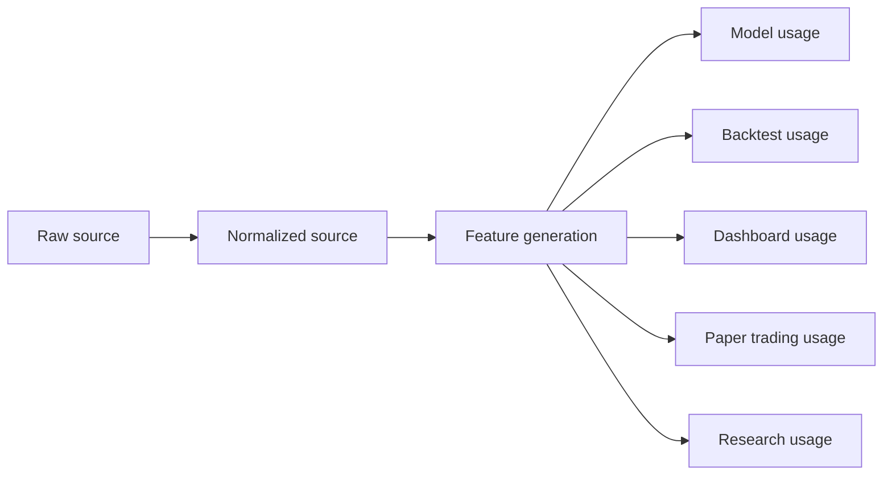

# Data Lineage Contract

## Contract

Every record that enters the platform must remain traceable through the following stages:

- raw source
- normalized source
- feature generation
- model usage
- backtest usage
- dashboard usage
- paper trading usage
- research usage

## Required Identifiers

| Identifier | Purpose |
| --- | --- |
| `snapshot_id` | Time-bounded representation of source state. |
| `lineage_id` | End-to-end lineage graph key. |
| `version_id` | Versioned artifact key. |
| `schema_version` | Structure compatibility key. |
| `source` | Raw source label. |
| `provider` | Upstream provider label. |
| `market` | Market family. |
| `market_type` | Market subtype. |
| `asset_class` | Asset class. |
| `quality_score` | Validation confidence. |

## Flow Diagram

## Rules

- Lineage must be immutable once published.
- A record may have multiple consumer edges, but each edge must reference the same canonical source version.
- Backtests and dashboards must not bypass lineage metadata.
